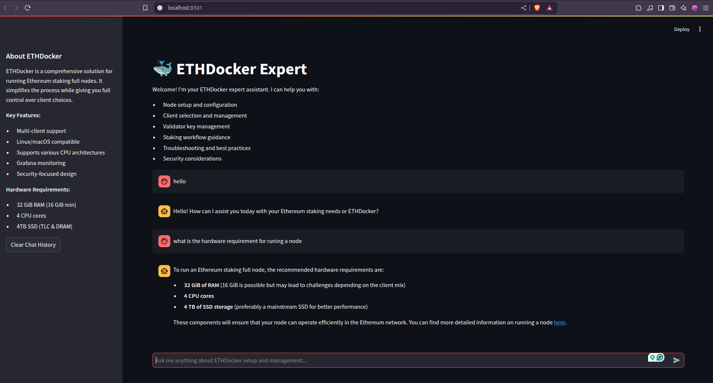

# ETHDocker Documentation Crawler and Knowledge Base

A powerful documentation crawler and knowledge base system that processes and stores documentation from ethdocker.com with advanced semantic search capabilities.



## Features

- 🕷️ Asynchronous web crawling with parallel processing
- 🧠 Semantic chunking with context preservation
- 🔍 Advanced vector search using OpenAI embeddings
- 📚 Version control and document history tracking
- 🔗 Hierarchical document structure with linked chunks
- 🏷️ Automatic keyword extraction and categorization
- ⚡ High-performance PostgreSQL storage with pgvector
- 🔄 Intelligent conflict resolution and version management
- 💬 Interactive Streamlit chat interface with ETHDocker expert
- 🚀 RESTful API endpoint for ETHDocker expert integration
- 📝 Conversation history tracking and management

## Components

### Crawler (`crawl_ethdocker_ai_docs.py`)

- Fetches and processes documentation from ethdocker.com
- Implements semantic chunking and versioning
- Handles document storage and updates

### Expert System (`ethdocker_expert.py`)

- Implements the ETHDocker expert agent
- Provides semantic search and document retrieval
- Features:
  - RAG-based document retrieval
  - Context-aware responses
  - Section hierarchy navigation
  - Version history tracking
  - Keyword-based filtering
  - Tool-based architecture for extensibility

### Chat Interface (`streamlit.py`)

- Interactive web interface for the expert system
- Real-time streaming responses
- Tool usage transparency
- Conversation management

### API Endpoint (`ethdocker_endpoint.py`)

- RESTful API for ETHDocker expert integration
- Features:
  - Bearer token authentication
  - Conversation history management
  - Error handling and logging
  - Client information tracking
  - Health check endpoint
  - CORS support
  - Supabase integration for message storage

## Prerequisites

- Python 3.8+
- PostgreSQL with pgvector extension
- Supabase account (for hosted database)
- OpenAI API key

## Installation

1. Clone the repository and set up a virtual environment:

```bash
python -m venv venv
source venv/bin/activate  # On Windows: venv\Scripts\activate
pip install -r requirements.txt
```

2. Copy the environment template and fill in your credentials:

```bash
cp .env.example .env
```

3. Configure your `.env` file with:

```
OPENAI_API_KEY=your_openai_api_key
SUPABASE_URL=your_supabase_url
SUPABASE_SERVICE_KEY=your_supabase_service_key
API_BEARER_TOKEN=your_api_token
LLM_MODEL=gpt-4-turbo-preview  # or your preferred model
PORT=8000  # Optional, defaults to 8000
```

4. Set up the database schemas:

```bash
# Using psql or your preferred PostgreSQL client
psql -d your_database -f site_pages.sql
psql -d your_database -f ethdocker_messages.sql
```

## Usage

### Crawler

Run the crawler to fetch and process documentation:

```bash
python crawl_ethdocker_ai_docs.py
```

The crawler will:

1. Fetch URLs from the ethdocker.com sitemap
2. Process documents in parallel with controlled concurrency
3. Split content into semantic chunks with context preservation
4. Generate embeddings and extract metadata
5. Store processed content with version control

### Interactive Chat Interface

Launch the Streamlit-based chat interface:

```bash
streamlit run streamlit.py
```

Features:

- 🤖 Interactive conversations with ETHDocker expert
- 📚 Real-time access to ETHDocker documentation
- 🔍 Semantic search capabilities
- 🔧 Transparent tool usage with expandable details
- 💾 Conversation history management
- ℹ️ Quick access to key information via sidebar
- 🧹 Clear chat history functionality

### API Endpoint

Start the API server:

```bash
python ethdocker_endpoint.py
```

The API will be available at `http://localhost:8000/api/ethdocker-expert`.

Example API request:

```bash
curl -X POST http://localhost:8000/api/ethdocker-expert \
  -H "Authorization: Bearer your_api_token" \
  -H "Content-Type: application/json" \
  -d '{
    "query": "What are the hardware requirements for ETHDocker?",
    "user_id": "user123",
    "request_id": "req123",
    "session_id": "session123"
  }'
```

Health check endpoint:

```bash
curl http://localhost:8000/api/health
```

## Database Schema

### Documentation Storage (`site_pages.sql`)

- Vector similarity search using pgvector
- Full-text search capabilities
- Document version history
- Hierarchical document structure
- Keyword-based filtering
- Metadata-based querying

### Conversation History (`ethdocker_messages.sql`)

- Session-based message storage
- JSON message format
- Timestamp tracking
- User and request tracking
- Client information storage
- Error message handling

## Architecture

### Document Processing

1. **Crawling**: Asynchronous crawling with rate limiting and error handling
2. **Chunking**: Smart text splitting with semantic boundary detection
3. **Enrichment**:
   - Title and summary generation using GPT-4
   - Keyword extraction
   - Section hierarchy tracking
   - Embedding generation
4. **Storage**:
   - Conflict resolution
   - Version management
   - Linked chunk references

### API Integration

1. **Authentication**:

   - Bearer token validation
   - Row-level security in Supabase

2. **Conversation Management**:

   - Session-based history
   - Message persistence
   - Error tracking

3. **Response Handling**:
   - Streaming support
   - Error recovery
   - Client feedback

### Performance Optimizations

- Parallel processing with controlled concurrency
- Efficient database indexing
- Caching and retry mechanisms
- Batch operations for better throughput

## Error Handling

The system includes:

- Automatic retries with exponential backoff
- Comprehensive logging
- Transaction management
- Conflict resolution
- Failure recovery

## Contributing

1. Fork the repository
2. Create a feature branch
3. Commit your changes
4. Push to the branch
5. Create a Pull Request

## License

[MIT License](LICENSE)

## Acknowledgments

- OpenAI for embedding and GPT-4 APIs
- Supabase for hosted PostgreSQL
- pgvector for vector similarity search
- Streamlit for the interactive interface
- FastAPI for the REST API endpoint
